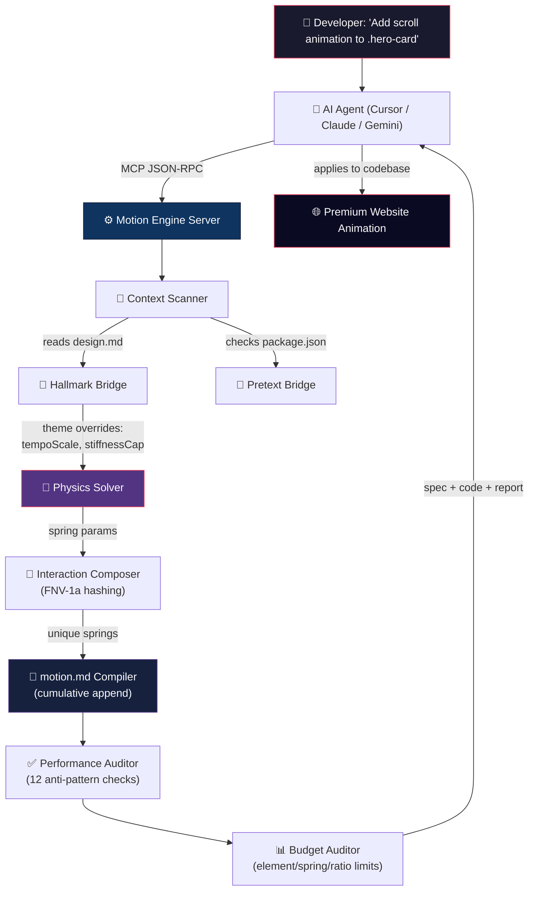

# 🌌 motion-engine-mcp

[](LICENSE)
[](https://nodejs.org/)
[](https://modelcontextprotocol.io)
[](#-running-tests)

A physics-based Model Context Protocol (MCP) Server that **forces LLMs to write premium, hardware-accelerated UI animations** instead of generic CSS defaults. It replaces lifeless `transition: all 0.3s ease` with deterministic spring physics, design-aware theming, real-time budget enforcement, and anti-pattern auditing.

Written entirely in **Node.js (ES Modules)** — runs instantly with zero compilation.

---

## 🎯 Why This Exists

### ❌ The Problem: AI Animation Slop

When you ask an AI coding agent to animate a UI component, it defaults to:

```css
/* Every. Single. Time. */
.card { transition: all 0.3s ease; opacity: 0; transform: translateY(-20px); }
.button { transition: all 0.3s ease; opacity: 0; transform: translateY(-20px); }
.nav { transition: all 0.3s ease; opacity: 0; transform: translateY(-20px); }
```

This creates **four critical problems**:

| Anti-Pattern | Why It's Bad |
|---|---|
| **`all`** | Forces the browser to monitor every CSS property for changes — wasting GPU cycles and causing FOUC |
| **`0.3s`** | An arbitrary duration that ignores element mass, travel distance, and brand tempo |
| **`ease`** | A generic cubic-bezier that can't overshoot, bounce, or handle interruption. Results in robotic, lifeless motion |
| **Identical motion everywhere** | Every element moves the same way. The page looks AI-generated. This is called **"animation slop"** |

### ✅ The Solution: Physics-Driven, Design-Aware Motion

`motion-engine-mcp` acts as a physics sandbox and design coordinator between your AI agent and the codebase:

```
WITHOUT Motion Engine:                    WITH Motion Engine:
─────────────────────                     ─────────────────────
.card  → opacity 0→1, ease 0.3s          .hero-card →
.btn   → opacity 0→1, ease 0.3s            spring: 300/20/1 (scroll trigger)
.nav   → opacity 0→1, ease 0.3s            translateY: amplitude 42px (FNV-1a hashed)
       ↑ all identical                      unique overshoot + settle curve

                                          .submit-btn →
                                            spring: 400/10/1 (click trigger)
                                            scale: amplitude 1.08 (hashed)
                                            snappy, responsive feel

                                          .nav-link →
                                            spring: 150/30/1 (hover trigger)
                                            opacity: damped reveal (hashed)
                                                 ↑ each element is unique
```

---

## ⚡ Quality Difference at a Glance

| Feature | Without Motion Engine | With Motion Engine |
|---|---|---|
| **Physics Model** | `cubic-bezier(0.4, 0, 0.2, 1)` (hardcoded) | Real spring solver: `stiffness / damping / mass` with overshoot and settle |
| **Element Uniqueness** | Every element animates identically | FNV-1a hashes CSS selectors → deterministic but unique amplitude per element |
| **Design Awareness** | None — luxury brand gets same bouncy animation as a SaaS dashboard | Reads `design.md` → serif typography slows tempo, luxury themes cap stiffness |
| **Budget Control** | No limit — AI adds animations to 15+ elements, causing jank | Max 8 elements, max 4 concurrent springs, max 30% decorative ratio |
| **Anti-Pattern Detection** | None | 12 automated checks: repeated translateY slop, `will-change: all`, `!important` abuse, etc. |
| **Persistence** | Each prompt creates standalone CSS. No page-level awareness | Cumulative `motion.md` — each tool call appends/merges into one comprehensive spec |
| **Text Animation** | `opacity: 0→1` on the whole paragraph | Reflow-free character/word reveals via `clip-path` + `transform` (zero CLS) |
| **Trigger Variety** | Only scroll reveals | `SCROLL`, `HOVER`, `CLICK`, `FOCUS`, `DRAG`, `PRESS` — each with physics-appropriate defaults |
| **Accessibility** | Missing | WCAG 2.3.3 `prefers-reduced-motion` queries built in |

---

### How It Works (Flow)



---

## ⚡ Quick Start & Setup Guide

### 🚀 Option 1: Zero-Clone via `npx` (Recommended)

No cloning needed. Run directly from GitHub:

#### Claude Desktop
Open `%APPDATA%\Claude\claude_desktop_config.json` (Windows) or `~/Library/Application Support/Claude/claude_desktop_config.json` (macOS):
```json
{
  "mcpServers": {
    "motion-engine": {
      "command": "npx",
      "args": ["-y", "github:warmsyntax/motion-engine"]
    }
  }
}
```

#### Cursor IDE
1. **Settings** → **Features** → **MCP** → **+ Add New MCP Server**
2. **Name**: `motion-engine` · **Type**: `stdio` · **Command**: `npx -y github:warmsyntax/motion-engine`

#### Claude Code
```bash
claude mcp add motion-engine -- npx -y github:warmsyntax/motion-engine
```

#### Gemini CLI
```bash
gemini mcp add motion-engine npx -y github:warmsyntax/motion-engine
```
Or add to `~/.gemini/settings.json`:
```json
{
  "mcpServers": {
    "motion-engine": {
      "command": "npx",
      "args": ["-y", "github:warmsyntax/motion-engine"]
    }
  }
}
```

#### Codex
```bash
codex mcp add motion-engine -- npx -y github:warmsyntax/motion-engine
```

#### OpenCode
```bash
opencode mcp add
```
Enter: **Name**: `motion-engine`, **Type**: `local`, **Command**: `npx -y github:warmsyntax/motion-engine`

Or add to `~/.config/opencode/opencode.jsonc`:
```json
{
  "mcp": {
    "motion-engine": {
      "type": "local",
      "command": ["npx", "-y", "github:warmsyntax/motion-engine"],
      "enabled": true
    }
  }
}
```

---

### 💻 Option 2: Local Clone (For Contributors)

```bash
git clone https://github.com/warmsyntax/motion-engine.git
cd motion-engine
npm install && npm run setup
```

Configure your client with the local path:

```json
"motion-engine": {
  "command": "node",
  "args": ["/absolute/path/to/motion-engine/index.js"]
}
```

---

## 🛠️ MCP API Reference

### Tools (6)

#### 1. `generate_motion_spec`
Core animation specification generator with physics solver.

| Argument | Type | Required | Description |
|---|---|---|---|
| `selector` | string | ✅ | CSS selector (e.g. `.hero-card`, `button.pay`) |
| `url` | string | | Live reference URL to scrape computed motion telemetry |
| `intent` | string | | Kinetic weight profile: `heavy` · `grounded` · `balanced` · `light` · `floating` |

**Output**: Appends to `motion.md` with physics constants, spatial constraints, thematic rules, performance mandates, and WCAG accessibility queries. Returns CSS/JS code snippets.

---

#### 2. `generate_text_animation`
Generates reflow-free text reveal animations using the Pretext bridge.

| Argument | Type | Required | Description |
|---|---|---|---|
| `selector` | string | ✅ | CSS selector for the text element |
| `splitBy` | string | | Split mode: `character` · `word` · `line` |

**Output**: If `@chenglou/pretext` is detected in `package.json`, generates Pretext-native code. Otherwise, falls back to `clip-path` + `transform` approach with zero CLS impact.

---

#### 3. `generate_interaction_spec`
Composes interaction primitives with deterministic FNV-1a hashing.

| Argument | Type | Required | Description |
|---|---|---|---|
| `selector` | string | ✅ | CSS selector for the interactive element |
| `trigger` | string | ✅ | `hover` · `click` · `focus` · `drag` · `press` · `scroll` |

**Output**: Generates unique spring parameters per selector — same selector always produces the same physics, but different selectors produce different motion.

---

#### 4. `generate_scroll_choreography`
Creates multi-element scroll stagger patterns with varied timing.

| Argument | Type | Required | Description |
|---|---|---|---|
| `selectors` | string[] | ✅ | Array of CSS selectors to choreograph |
| `pattern` | string | | Stagger pattern: `cascade` · `radial` · `parallel-lanes` |

**Output**: Coordinated scroll-reveal sequence where each element enters with unique timing, amplitude, and spring feel.

---

#### 5. `validate_motion_performance`
Audits the current `motion.md` for 12 animation anti-patterns.

| Argument | Type | Required | Description |
|---|---|---|---|
| *(none)* | | | Scans the workspace `motion.md` automatically |

**Detects**: Repeated `translateY` slop · `will-change: all` · `!important` abuse · excessive `z-index` layering · layout-triggering properties · missing `prefers-reduced-motion` · and 6 more.

---

#### 6. `assess_motion_budget`
Enforces viewport performance constraints on the accumulated motion spec.

| Argument | Type | Required | Description |
|---|---|---|---|
| *(none)* | | | Audits the workspace `motion.md` automatically |

**Enforces**:
| Limit | Threshold |
|---|---|
| Max animated elements in viewport | 8 |
| Max concurrent spring solvers | 4 |
| Max stagger elements | 12 |
| Max repeated identical patterns | 2 |
| Max decorative animation ratio | 30% |

---

### Prompts (3)

#### 1. `motion_intent`
Three-question interactive setup for animation requirements.

| Argument | Options |
|---|---|
| `kinetic_weight` | `heavy` · `grounded` · `balanced` · `light` · `floating` |
| `trigger_geometry` | `scroll` · `hover` · `time` · `scroll-scrub` · `click` |
| `spatial_plane` | `2d` · `2.5d` |

#### 2. `design_audit`
Four-question guided design context and framework audit.

| Argument | Options |
|---|---|
| `project_type` | `Landing` · `SaaS` · `E-commerce` · `Portfolio` · `Blog` |
| `brand_personality` | `Playful` · `Professional` · `Luxurious` · `Minimal` · `Bold` |
| `framework` | `React` · `Vue` · `Svelte` · `Vanilla` · `Astro` · `Next.js` |
| `animations` | `Scroll reveals` · `Hover effects` · `Page transitions` · `Text animations` · `All` |

#### 3. `component_motion`
Quick three-question assistant for component-level motion.

| Argument | Options |
|---|---|
| `component` | `Button` · `Card` · `Modal` · `Nav` · `Hero` · `Form` · `Toast` · `Dropdown` |
| `trigger` | `Hover` · `Click` · `Scroll` · `Mount` · `Focus` |
| `feel` | `Snappy` · `Smooth` · `Bouncy` · `Heavy` · `Floating` |

---

## 🔌 Integration Bridges

### Hallmark Bridge (`integration/hallmark_bridge.js`)

Reads a `design.md` file (Hallmark design system format) from the workspace and extracts:

| Design Token | Effect on Motion |
|---|---|
| **Macrostructure** (e.g. "Asymmetric Grid") | Maps to choreography pattern (→ `radial` stagger) |
| **Type-Pairing** (e.g. "Editorial Serif") | Caps stiffness at 200, slows tempo to 0.7× |
| **Theme Fingerprint** (e.g. "Luxury") | Further tempo reduction to 0.6×, overdamped feel |
| **Colour Anchor** | Reserved for future contrast-aware animation intensity |

### Pretext Bridge (`integration/pretext_bridge.js`)

Detects `@chenglou/pretext` in the workspace `package.json`. When available:
- Generates native Pretext text animation code (character/word/line splitting)
- Zero layout reflow — uses `clip-path` and `transform` only
- Zero CLS (Cumulative Layout Shift) impact
- Falls back to CSS-only approach when Pretext is not installed

---

## 🔬 Core Engine Deep Dive

### Physics Solver
Instead of hardcoded easing curves, the engine solves the **damped harmonic oscillator** equation:

- **Underdamped** (ζ < 1.0): `x(t) = e^(-γt) · [cos(ωd·t) + (γ/ωd)·sin(ωd·t)]`
- **Overdamped** (ζ > 1.0): `x(t) = e^(-γt) · [cosh(βt) + (γ/β)·sinh(βt)]`

The curve fitter sweeps stiffness (k) and damping (c), then runs local gradient descent for sub-millisecond fitting.

### FNV-1a Deterministic Hashing
Each CSS selector is hashed using the FNV-1a algorithm to produce deterministic but unique spring amplitudes:
- `.hero-card` always produces the same motion parameters
- `.hero-card` and `.nav-link` produce different motion
- Reproducible across sessions — no randomness

### Cumulative `motion.md` Compiler
Every tool call **appends** to the workspace `motion.md` rather than overwriting. This means:
- Multiple calls build a comprehensive, full-page animation spec
- The AI agent maintains page-level awareness across prompts
- Performance auditor and budget enforcer can analyze the complete picture

### Performance Auditor (12 Checks)
| # | Anti-Pattern | Severity |
|---|---|---|
| 1 | Repeated identical `translateY` reveals | ⚠️ Warning |
| 2 | `will-change: all` (GPU memory waste) | 🔴 Error |
| 3 | `!important` in animation properties | 🔴 Error |
| 4 | Layout-triggering properties (`width`, `height`, `top`, `left`) | 🔴 Error |
| 5 | Missing `prefers-reduced-motion` | ⚠️ Warning |
| 6 | Excessive `z-index` layering (> 5 layers) | ⚠️ Warning |
| 7 | Direct `box-shadow` animation (triggers Paint) | 🔴 Error |
| 8 | `transition: all` wildcard monitoring | ⚠️ Warning |
| 9 | Unbounded animation duration (> 2s) | ⚠️ Warning |
| 10 | Competing `transform` declarations | 🔴 Error |
| 11 | Non-compositor property animation | ⚠️ Warning |
| 12 | Visual coherence limit (> 3 unique animation structures) | ℹ️ Info |

---

## 🧪 Running Tests

```bash
npm test
```

Runs **25 tests** across two test runners:

| Suite | Framework | Tests | Validates |
|---|---|---|---|
| `tests/auditor.test.js` | `node:test` | Performance auditor scanning | Anti-pattern detection |
| `tests/bridges.test.js` | `node:test` | Pretext + Hallmark bridges | Design DNA parsing, text codegen |
| `tests/budget.test.js` | `node:test` | Budget parsing + validation | Element/spring/ratio enforcement |
| `tests/composer.test.js` | `node:test` | Interaction composer | FNV-1a determinism, amplitude mapping |
| `tests/registry.test.js` | `node:test` | MCP server handshake | Tool/prompt registry, JSON-RPC protocol |
| `test.js` | Custom | 17 math/physics tests | Matrix decomposition, noise generation, spring solvers, curve fitter |

---

## 📄 License

Licensed under the [MIT License](LICENSE).
